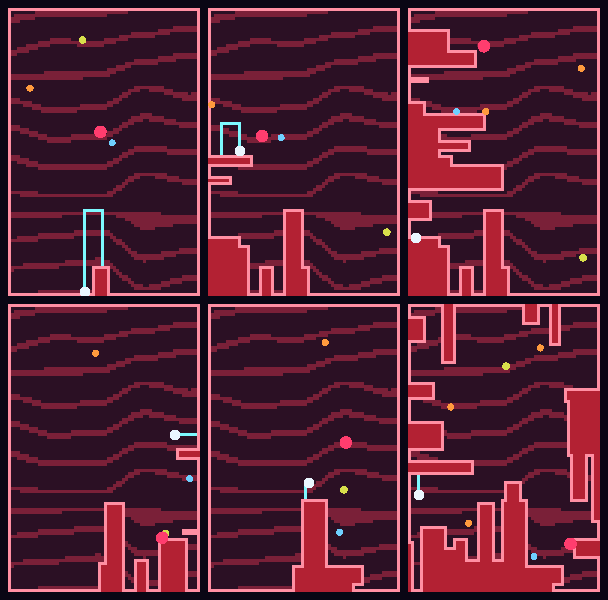

# Kuşat

Volfied / Qix tarzı alan kapatma oyunu. Aynı oyun motoru iki yerde çalışır:
**mobil** (Expo / React Native + Skia) ve **web** (Canvas2D).

Kenardan içeri dalıp iz bırakırsın, izi ele geçirilmiş alana bağladığında kapattığın
bölge senin olur. Patronun bulunduğu bölge dolmaz; onu köşeye sıkıştırırsan alanın
geri kalanı bir hamlede senin olur. Sıradan düşmanlar kapattığın bölgede kalırsa yok olur.



*Motor başsız çalıştırılarak üretilmiş gerçek kareler (`npm run preview`).*

## Oynanış

| Kural | Ayrıntı |
| --- | --- |
| Hedef | İç alanın **%80'ini** ele geçirmek |
| Hareket | Gemi yalnızca ele geçirilmiş alanın **kenarında** yürür; bloğun içine giremez |
| Güvenli bölge | Kenarda dururken düşmanlar sana değemez |
| Dalış | Kenardan boş alana yalnızca **ÇİZ** tuşu basılıyken çıkılır |
| Risk | Boş alana girdiğin anda iz bırakmaya başlarsın ve açıktasın |
| Ölüm | Düşman izine veya sana değerse, ya da kendi izine girersen |
| Patron (pembe) | Bulunduğu bölge ele geçirilemez, her yerde tehlikelidir |
| Gezgin (turuncu) | Rastgele seker; kapatılan bölgede kalırsa yok olur ve puan verir |
| Avcı (sarı) | 4. seviyeden sonra çıkar, seni takip eder |

**Kontrol:** ekrana parmağını koy — dokunduğun nokta joystick merkezi olur, 8 yöne
hareket edebilirsin; parmağını kaldırınca gemi durur. Boş alana dalmak için sağdaki
**ÇİZ** tuşunu basılı tutman gerekir: tuşa basmadan kenardan çıkamazsın, böylece
kazara dalış olmaz. İz başladıktan sonra tuşu bırakabilirsin. Web sürümünde ayrıca
yön tuşları veya WASD, ÇİZ için Shift, boşluk/ESC ile duraklatma çalışır.

## Çalıştırma

### Web (en hızlısı)

```bash
npm install
npm run dev:web     # http://127.0.0.1:4173
```

`npm run build:web` üç çıktı üretir:

| Dosya | Ne işe yarar |
| --- | --- |
| `dist/index.html` + `dist/main.js` | Statik site (GitHub Pages, Netlify) |
| `dist/kusat.html` | Tek dosyalık sürüm — çift tıklayıp oynanır, tek başına paylaşılabilir |
| `dist/artifact.html` | Belge iskeletini kendisi saran ortamlar için gövde + stil |

### Mobil (Expo)

```bash
npm install
npx expo start
```

Telefondaki **Expo Go** ile QR kodu okut. Kullanılan tüm native modüller
(Skia, haptics, async-storage, safe-area-context) Expo Go içinde geldiği için
ayrı bir native derleme gerekmez.

## Yayınlama

Web sürümü `dist/` altına tamamen statik olarak derlenir (tek HTML + ~18 KB JS,
wasm yok), yani her statik barındırma servisinde çalışır.

### GitHub Pages

`.github/workflows/deploy-pages.yml` hazır. Tek seferlik ayar:

1. **Settings → Pages → Build and deployment → Source: GitHub Actions**
2. `master` dalına gelen her push'ta yayın kendiliğinden güncellenir.
   Birleştirmeden önce denemek için **Actions → "Web sürümünü GitHub Pages'e yayınla" → Run workflow**
   ile istediğin daldan elle de çalıştırabilirsin.

Adres: `https://ozdoganosman.github.io/LudusGame/`

### Netlify

`netlify.toml` build komutunu ve yayın dizinini tanımlıyor; Netlify'da depoyu
bağlamak dışında ayar gerekmez (Add new site → Import an existing project).
Hızlı yol olarak `npm run build:web` sonrası `dist/` klasörünü
[app.netlify.com/drop](https://app.netlify.com/drop) adresine sürükleyebilirsin.

## Geliştirme

```bash
npm test         # motor testleri (26 test)
npm run typecheck
npm run lint
npm run build:web  # dist/ üretir
npm run preview    # motoru başsız oynatıp docs/preview.png üretir
```

## Yapı

```
src/engine/        Platformdan bağımsız oyun motoru (saf TypeScript, React içermez)
  types.ts         Hücre durumları, düşman ve olay tipleri
  config.ts        Alan boyutu, hızlar, zorluk eğrisi
  field.ts         Grid, bölge etiketleme (flood fill), ele geçirme kuralları
  game.ts          Oyuncu adımları, düşman davranışı, çarpışma, seviye akışı
  input.ts         8 yöne yuvarlama + ölü bölge (mobil ve web ortak kullanır)
  rng.ts           Deterministik PRNG (testler tekrarlanabilir olsun diye)
src/ui/            React Native / Skia katmanı
  GameCanvas.tsx   Grid'i RGBA tamponundan Skia görüntüsüne çevirip çizer
  Joystick.tsx     PanResponder tabanlı serbest yerleşimli joystick
  Hud.tsx          Seviye, puan, yüzde çubuğu, canlar
  contour.ts       Sınır çokgeni çıkarma ve merdiven köşelerini pahlama
  gridImage.ts     Alan -> piksel dönüşümü (zemin ve ham grid görünümü)
  palette.ts       Tek renk kaynağı
web/               Web sürümü: Canvas2D render + DOM arayüzü
  body.html        Arayüz iskeleti (HUD, alan, joystick, panel)
  styles.css       Görünüm; renkleri palette'ten CSS değişkeni olarak alır
  main.ts          Çizim, girdi (dokunmatik + klavye), HUD, ekran akışı
tools/
  build-web.mjs    esbuild paketleme; üç çıktıyı tek kaynaktan oluşturur
                   (--serve ile yerel sunucu ve izleme)
  preview.ts       Başsız oynatma + PNG kare üretimi
App.tsx            Mobil ekran akışı (menü / oyun / duraklatma / seviye sonu / oyun sonu)
```

### Tasarım notları

- **Motor React'ten bağımsız.** Tüm oyun mantığı `src/engine` içinde saf TypeScript;
  bu yüzden cihaz olmadan `node` ile test edilebiliyor, web sürümü aynı motoru
  paylaşıyor ve PNG önizlemesi üretilebiliyor.
- **Kenar hattı.** Volfied'daki gibi gemi ele geçirilmiş bölgenin dış hattında
  hareket eder (`Field.isEdge`: boş alana komşu dolu hücreler). Kapatma gemiyi
  bloğun içinde bırakırsa en yakın kenara çekilir. Kenar hücresinin tanımı gereği
  her zaman boş bir komşusu vardır, yani gemi asla kilitlenmez.
- **Ele geçirme.** İz kapandığında boş hücreler 4 komşuluk üzerinden bölgelere ayrılır;
  patronun bulunmadığı her bölge doldurulur. 4 komşuluk seçilmesi izin çapraz
  hareketlerde de sızdırmaz bir duvar olmasını sağlar.
- **Çizim.** Oyun mantığı hücre tabanlı ama görüntü değil: ele geçirilmiş alanın
  sınırı `src/ui/contour.ts` ile çokgen olarak çıkarılır ve merdiven köşeleri
  pahlanır (tek hücrelik kenarların köşesi yarıdan kesilince ardışık basamaklar
  tek bir 45° doğruya dönüşür; alan çerçevesi gibi uzun kenarların köşeleri
  keskin kalır). Böylece çapraz kesimler pikselli merdiven yerine düz çizgi
  görünür. Zemin (boş alan + nokta dokusu) değişmediği için bir kez kodlanır;
  sınır çokgeni ve iz yalnızca hücreler değişince (`Field.version`) yeniden
  kurulur, her karede değil. Aynı çokgenler iki render katmanında da kullanılır:
  webde Canvas2D yolu, mobilde Skia `Path`.
- **`npm run preview` ham grid görünümünü üretir** (hücre hücre boyanmış):
  doldurma mantığını gözle denetlemek için kasıtlı olarak yumuşatılmamıştır.
- **Zaman adımı** `MAX_DT` ile sınırlıdır; uygulama arka plandan döndüğünde oyuncu
  veya düşmanlar ışınlanmaz.

## Bilinen sınırlar

- Ses/müzik yok.
- Mobil sürüm cihazda (Expo Go) elle oynanmadı; doğrulama motor testleri, Metro
  paketlemesi ve başsız PNG önizlemesi ile yapıldı. Web sürümü Chromium'da
  (dokunmatik emülasyonuyla) oynanarak doğrulandı.
- Expo'nun kendi web hedefi (`npx expo start --web`) denenmedi; Skia'nın web'de
  CanvasKit (wasm) gerektirmesi nedeniyle web için ayrı ve çok daha hafif olan
  Canvas2D sürümü yazıldı.
